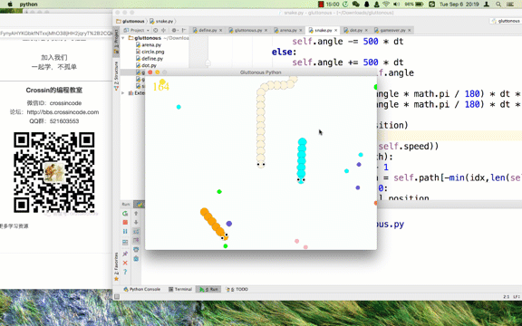

# 贪吃蛇大作战 - Python 实现

game of gluttonous python（仿制《贪吃蛇大作战》）

Powered by cocos2d

`pip install cocos2d`

演示：

[点击打开视频](http://v.qq.com/iframe/player.html?vid=f1309ieuz4y&width=670&height=502.5&auto=0)

知乎：[Crossin](https://www.zhihu.com/people/crossin)

微信公众号：Crossin的编程教室（crossincode）

——————————————————————————————————————————————————————分割线——————————————————————————————————————————————————————

灌注知乎Crossin喵，灌注Crossin谢谢喵 ：3

以上是原版作者信息

不论原版新版，在Ubuntu上都可以这样运行：
在命令提示符中，
1. 安装python：
sudo apt update
sudo apt install python3
2. 安装各类包：
pip install pygame
pip install cocos（实际上只用了cocos2d）
pip install pyglet
3. 解释python文件：
python3 gluttonous.py

然后用键盘、鼠标操作游戏。